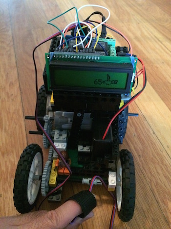
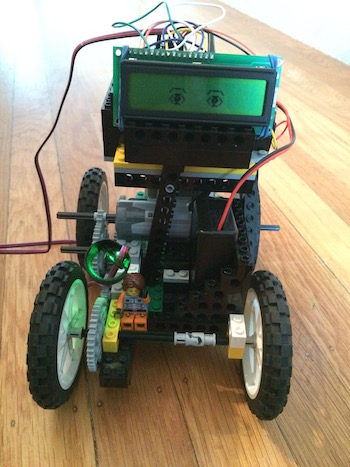
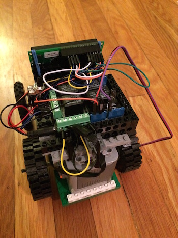
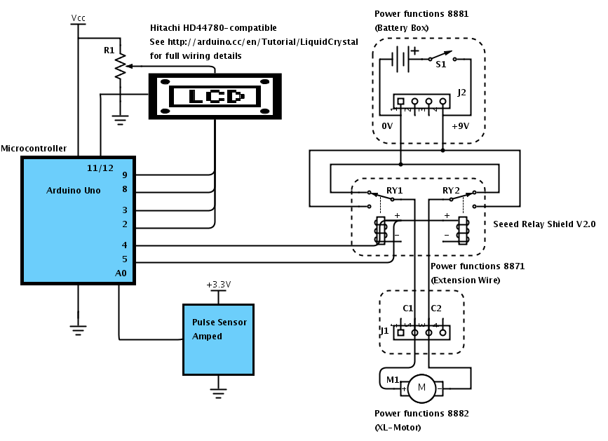

# README

LegoRobot is a simple Arduino sketch that controls a Lego Power Functions XL-Motor using the Pulse Sensor Amped heart rate sensor (the heavy lifting of converting the analog reading to a BPM value is done using [Pulse Sensor Amped sample Arduino code](http://pulsesensor.myshopify.com/pages/code-and-guide)).  As designed, it turns the motor on in reverse if the detected heart rate is above 80 BPM and forward if the heart rate is above 90 BPM.  The motor is turned off if the heart rate is below 80 or cannot be detected.  

For fun, it also shows a flying bird with the current heart rate (or blinking eyes when a heart rate is not detected) via an attached 2x16 LCD.

## Hardware required
* [Arduino Uno](http://arduino.cc/en/Main/arduinoBoardUno) (it will probably work with other variants, but I've only tested it with the Uno)
* [Pulse Sensor Amped](http://pulsesensor.myshopify.com/products/pulse-sensor-amped) heart rate sensor
* Hitachi HD44780 driver-compatible LCD display
* Seed [Relay Shield](http://www.seeedstudio.com/depot/Relay-shield-p-693.html)
* Lego [Power Functions Battery Box, Extension Wire, and XL-Motor](http://shop.lego.com/en-US/LEGO-Power-Functions-Motor-Set-8293)

Here's the setup with the motor controlling a 4-wheel robot:

## Schematic

## Dependencies

Arduino libraries:

* [TimerOne_r11](https://code.google.com/p/arduino-timerone/downloads/list)

## Building

* dissect a Power Functions 8871 Extension Wire so that it can be controlled by the relays on the Relay Shield.  The key is to connect +9V/0 from the Battery Box to pins C1 and C2 of the XL-Motor to control its direction as follows:

| Direction | forwardPin (4) | reversePin (5) | Control C1 | Control C2 |
| --------- | -------------- | -------------- | -- | -- |
| Off       | 0              | 0              | 0  | 0  |
| Forward   | 1              | 0              | +9 | 0  |
| Reverse   | 0              | 1              | 0  | +9 |
| N/A       | 1              | 1              | +9 | +9 |

* plug the Relay Shield on top of the Uno, and connect the Form C terminals to the Extension Wire as shown in the schematic
* connect the XL-Motor to something fun, like a wheeled robot or helicopter
* connect the Pulse Sensor Amped to analog input 0 and the +3.3V power supply
* connect the LCD display to pins 2, 3, 8, 9, 11 and 12 using this [tutorial](http://arduino.cc/en/Tutorial/LiquidCrystal)
* build and download the Arduino sketch
